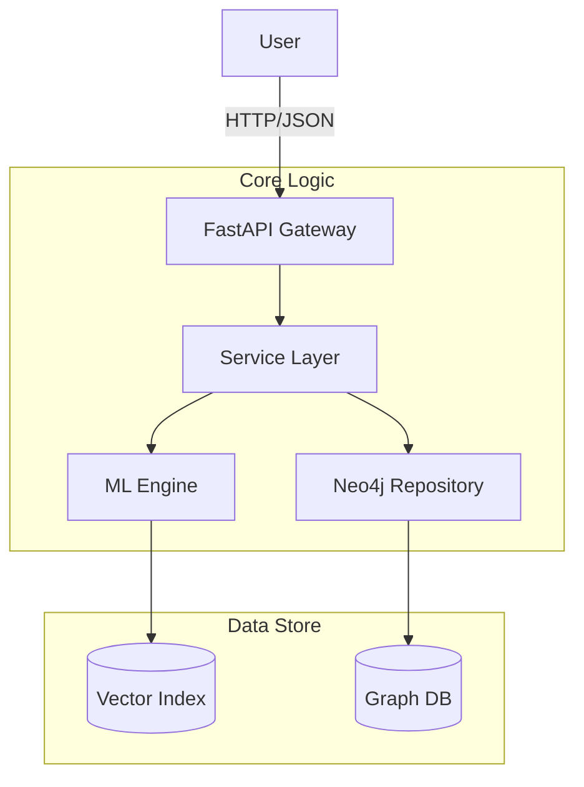

# 🚀 SkillAlign

> **AI-Powered Career Compass & Skill Gap Analyzer**


SkillAlign is an advanced occupation recommendation engine that leverages the **ESCO** (European Skills, Competences, Qualifications and Occupations) taxonomy. It combines **Knowledge Graphs** with **Semantic Vector Search** to provide hyper-personalized career guidance.

---

## 🌟 Key Features

- **🧠 Semantic Search**: Uses Transformer-based embeddings (`all-mpnet-base-v2`) to understand the *meaning* of skills, not just keywords.
- **🕸️ Knowledge Graph**: Built on Neo4j to map complex relationships between 3,000+ occupations and 13,000+ skills.
- **📊 Skill Gap Analysis**: Instantly identifies "Essential" vs. "Optional" skills missing from a user's profile for any target job.
- **📝 Personalization**: Built-in Notes API to track learning progress against specific career goals.
- **⚡ High Performance**: Sub-millisecond vector similarity search using FAISS.

---

## 🏗️ Architecture

SkillAlign follows a clean **Service-Oriented Architecture (SOA)**:



---

## 🛠️ Technology Stack

| Component | Tech | Description |
| :--- | :--- | :--- |
| **Backend** | `FastAPI` | Async, type-safe Python API |
| **Database** | `Neo4j` | Graph database for managing taxonomy |
| **ML Engine** | `FAISS` + `SentenceTransformers` | Vector similarity search |
| **Validation** | `Pydantic` | Data validation & settings management |
| **Environment** | `Python 3.10` | Core runtime |

---

## 🚀 Getting Started

### Prerequisites
- Python 3.10+
- Neo4j Database (Local or Aura)
- Windows (Powershell) / Linux / Mac

### Installation

1. **Clone the repository**
   ```bash
   git clone https://github.com/yourusername/skillalign.git
   cd skillalign
   ```

2. **Create Virtual Environment**
   ```powershell
   python -m venv venv
   .\venv\Scripts\activate
   ```

3. **Install Dependencies**
   ```powershell
   pip install -r requirements.txt
   ```

4. **Environment Setup**
   Create a `.env` file in the root directory:
   ```env
   NEO4J_URI=bolt://localhost:7687
   NEO4J_USER=neo4j
   NEO4J_PASSWORD=your_password
   ```

### Running the App

```powershell
# Start the server with hot-reload
uvicorn app.api.main:app --reload
```

The API will be available at [http://localhost:8000](http://localhost:8000).

---

## 📚 API Documentation

Interactive documentation is automatically generated:

- **Swagger UI**: [http://localhost:8000/docs](http://localhost:8000/docs)
- **ReDoc**: [http://localhost:8000/redoc](http://localhost:8000/redoc)

### Core Endpoints

| Method | Endpoint | Description |
| :--- | :--- | :--- |
| `POST` | `/recommendations` | Get career matches based on skills |
| `GET` | `/notes` | Search user notes |
| `PUT` | `/notes/...` | Upsert a note for an occupation |
| `GET` | `/catalog/occupations` | Autocomplete search for jobs |

---

## 🔮 Roadmap: Frontend

We are building a modern React frontend to visualize this data!

- **Framework**: Next.js 14
- **Styling**: Tailwind CSS + Radix UI
- **Features**: Interactive career graphs, drag-and-drop skill selector.

---

*Built with ❤️ for the Future of Work.*
