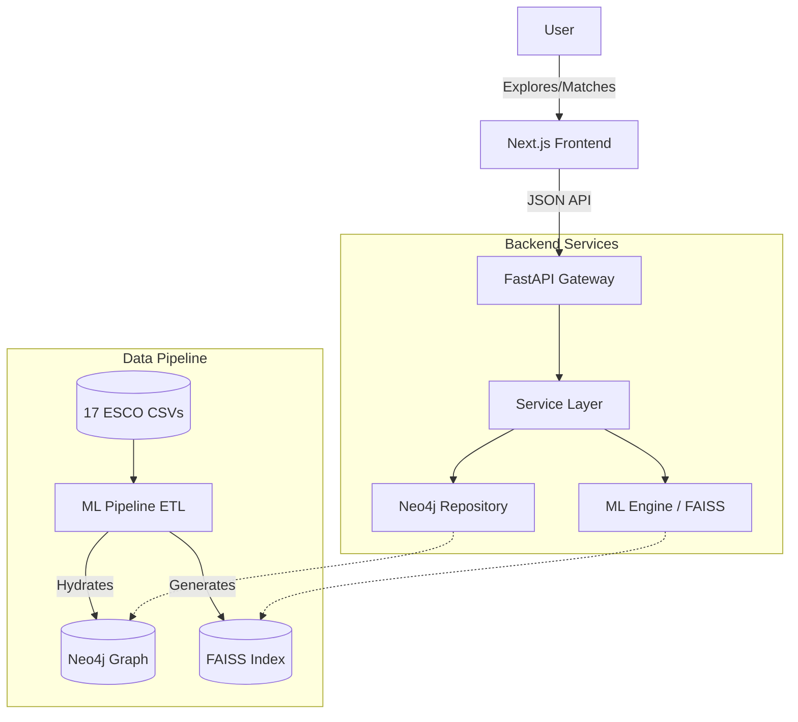

# 🚀 SkillAlign

> **AI-Powered Career Recommendation Engine & Skill Gap Analyzer**


SkillAlign is an advanced, AI-driven occupation recommendation engine that matches user skills to professional opportunities. By leveraging the **ESCO** (European Skills, Competences, Qualifications and Occupations) taxonomy and a **Neo4j Knowledge Graph**, it transcends keyword matching to provide semantically rich, explainable career guidance.

---

## 🌟 Key Features

- **🧠 Semantic Understanding**: Uses Transformer-based embeddings (`all-mpnet-base-v2`) to map skills to occupations based on deep meaning rather than simple keywords.
- **🕸️ Knowledge Graph (Neo4j)**: Visualizes and analyzes the complex relationships between 3,000+ occupations and 13,000+ skills.
- **📊 Skill Gap Analysis**: Distinguishes between skills a user *has* and skills they *need* for a target role, providing a clear career roadmap.
- **📝 Admin Insights**: Built-in capabilities for curators to add context-specific notes to any occupation in the taxonomy.
- **⚡ High Performance**: Sub-800ms recommendation generation backed by FAISS vector similarity search.

---

## 🏗️ Architecture

SkillAlign follows a modern architecture designed for transparency, scalability, and agility:



---

## 🛠️ Technology Stack

| Component | Tech | Description |
| :--- | :--- | :--- |
| **Frontend** | `Next.js 14` | React, Tailwind CSS, Radix UI & React Query |
| **Backend** | `FastAPI` | Async Python 3.10+ with Pydantic validation |
| **Database** | `Neo4j 5.x` | Graph DB for taxonomy and relationship mapping |
| **ML Engine** | `FAISS` + `mpnet` | Vector search using SentenceTransformers |
| **Data Source** | `ESCO Taxonomy` | 17 CSV files (Core, Relations, Collections) |

---

## 🚀 Getting Started

### Prerequisites
- **Python 3.10+**
- **Node.js 18+** (for Frontend)
- **Neo4j Database** (Local instance recommended)
- **ESCO Data**: Ensure the ESCO CSVs are located in `./data/esco/`

### Installation

1. **Clone and Setup Backend**
   ```powershell
   git clone https://github.com/yourusername/SkillAlign.git
   cd SkillAlign
   python -m venv venv
   .\venv\Scripts\activate
   pip install -r requirements.txt
   ```

2. **Configure Environment**
   Update the `.env` file in the root directory with your Neo4j credentials. This file is the central source of configuration for the ML pipeline and the API.
   ```env
   # Neo4j Settings
   NEO4J_URI=neo4j://localhost:7687
   NEO4J_USER=neo4j
   NEO4J_PASSWORD=your_secure_password
   
   # Application Settings
   ENVIRONMENT=development
   UVICORN_PORT=8000
   ```

### 🧠 Data Synchronization (Mandatory First Step)
Before running the app, you must hydrate the database and generate the vector index from the ESCO CSV files. Run the following command from the root:
```powershell
python -m ml_pipeline.run_pipeline
```
*This will execute the 4-stage pipeline: Data Ingestion, Processing, Neo4j ETL, and FAISS Indexing.*

---

## 💻 Running the Application

### 1. Start the API (Backend)
```powershell
uvicorn app.api.main:app --reload
```
- **API Docs**: [http://localhost:8000/docs](http://localhost:8000/docs)

### 2. Start the Web App (Frontend)
```powershell
cd app/frontend
npm install
npm run dev
```
- **UI Interface**: [http://localhost:3000](http://localhost:3000)

---

*Built for the Future of Work by Yasser Khattach.*
